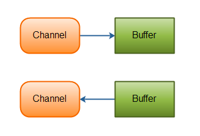
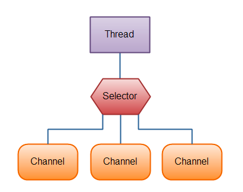
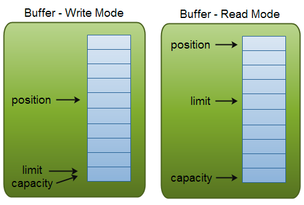
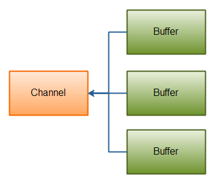

# Java NIO 系列教程

[原文地址](http://tutorials.jenkov.com/java-nio/index.html) **作者**:Jakob Jenkov **译者**:郭蕾 **校对**:方腾飞

Java NIO(New IO)是一个可以替代标准Java IO API的IO API（从Java 1.4开始)，Java NIO提供了与标准IO不同的IO工作方式。

**Java NIO: Channels and Buffers（通道和缓冲区）**

标准的IO基于字节流和字符流进行操作的，而NIO是基于通道（Channel）和缓冲区（Buffer）进行操作，数据总是从通道读取到缓冲区中，
或者从缓冲区写入到通道中。

**Java NIO: Non-blocking IO（非阻塞IO）**

Java NIO可以让你非阻塞的使用IO，例如：当线程从通道读取数据到缓冲区时，线程还是可以进行其他事情。当数据被写入到缓冲区时，
线程可以继续处理它。从缓冲区写入通道也类似。

**Java NIO: Selectors（选择器）**

Java NIO引入了选择器的概念，选择器用于监听多个通道的事件（比如：连接打开，数据到达）。因此，单个的线程可以监听多个数据通道

## Java NIO系列教程（一） Java NIO 概述

Java NIO 由以下几个核心部分组成：

- Channels
- Buffers
- Selectors

虽然Java NIO 中除此之外还有很多类和组件，但在我看来，`Channel`，`Buffer` 和 `Selector` 构成了核心的API。
其它组件，如Pipe和FileLock，只不过是与三个核心组件共同使用的工具类。因此，在概述中我将集中在这三个组件上。其它组件会在单独的章节中讲到。

### Channel 和 Buffer

基本上，所有的 IO 在NIO 中都从一个Channel 开始。Channel 有点象流。 数据可以从Channel读到Buffer中，也可以从Buffer 写到Channel中。
这里有个图示：



Channel和Buffer有好几种类型。下面是JAVA NIO中的一些主要Channel的实现：

- FileChannel
- DatagramChannel
- SocketChannel
- ServerSocketChannel

正如你所看到的，这些通道涵盖了UDP 和 TCP 网络IO，以及文件IO。

与这些类一起的有一些有趣的接口，但为简单起见，我尽量在概述中不提到它们。本教程其它章节与它们相关的地方我会进行解释。

以下是Java NIO里关键的Buffer实现：

- ByteBuffer
- CharBuffer
- DoubleBuffer
- FloatBuffer
- IntBuffer
- LongBuffer
- ShortBuffer

这些Buffer覆盖了你能通过IO发送的基本数据类型：byte, short, int, long, float, double 和 char。

Java NIO 还有个 MappedByteBuffer，用于表示内存映射文件， 我也不打算在概述中说明。

### Selector

Selector允许单线程处理多个 Channel。如果你的应用打开了多个连接（通道），但每个连接的流量都很低，使用Selector就会很方便。
例如，在一个聊天服务器中。

这是在一个单线程中使用一个Selector处理3个Channel的图示：



要使用Selector，得向`Selector`注册`Channel`，然后调用它的`select()`方法。
这个方法会一直阻塞到某个注册的通道有事件就绪。一旦这个方法返回，线程就可以处理这些事件，事件的例子有如新连接进来，数据接收等。

## Java NIO系列教程（二） Channel

Java NIO的通道类似流，但又有些不同：

- 既可以从通道中读取数据，又可以写数据到通道。但流的读写通常是单向的。
- 通道可以异步地读写。
- 通道中的数据总是要先读到一个Buffer，或者总是要从一个Buffer中写入。

正如上面所说，从通道读取数据到缓冲区，从缓冲区写入数据到通道。如下图所示：


### Channel的实现

这些是Java NIO中最重要的通道的实现：

- FileChannel 从文件中读写数据。
- DatagramChannel 能通过UDP读写网络中的数据。
- SocketChannel 能通过TCP读写网络中的数据。
- ServerSocketChannel 可以监听新进来的TCP连接，像Web服务器那样。对每一个新进来的连接都会创建一个SocketChannel。

### 基本的 Channel 示例

下面是一个使用FileChannel读取数据到Buffer中的示例：

```java
RandomAccessFile aFile = new RandomAccessFile("data/nio-data.txt", "rw");  
FileChannel inChannel = aFile.getChannel();

ByteBuffer buf = ByteBuffer.allocate(48);

int bytesRead = inChannel.read(buf);  
while (bytesRead != -1) {
    System.out.println("Read " + bytesRead);  
    buf.flip();

    while(buf.hasRemaining()){  
      System.out.print((char) buf.get());  
    }

    buf.clear();  
    bytesRead = inChannel.read(buf);  
}  
aFile.close();  
```

注意 buf.flip() 的调用，首先读取数据到Buffer，然后反转Buffer,接着再从Buffer中读取数据。下一节会深入讲解Buffer的更多细节。

## Java NIO系列教程（三） Buffer

Java NIO中的Buffer用于和NIO通道进行交互。如你所知，数据是从通道读入缓冲区，从缓冲区写入到通道中的。

缓冲区本质上是一块可以写入数据，然后可以从中读取数据的内存。这块内存被包装成NIO Buffer对象，并提供了一组方法，用来方便的访问该块内存。

下面是NIO Buffer相关的话题列表：

### Buffer的基本用法

使用Buffer读写数据一般遵循以下四个步骤：

1. 写入数据到Buffer
2. 调用`flip()`方法
3. 从Buffer中读取数据
4. 调用`clear()`方法或者`compact()`方法

当向buffer写入数据时，buffer会记录下写了多少数据。一旦要读取数据，需要通过flip()方法将Buffer从写模式切换到读模式。在读模式下，可以读取之前写入到buffer的所有数据。

一旦读完了所有的数据，就需要清空缓冲区，让它可以再次被写入。有两种方式能清空缓冲区：调用clear()或compact()方法。clear()方法会清空整个缓冲区。compact()方法只会清除已经读过的数据。任何未读的数据都被移到缓冲区的起始处，新写入的数据将放到缓冲区未读数据的后面。

下面是一个使用Buffer的例子：

```java
RandomAccessFile aFile = new RandomAccessFile("data/nio-data.txt", "rw");  
FileChannel inChannel = aFile.getChannel();

//create buffer with capacity of 48 bytes  
ByteBuffer buf = ByteBuffer.allocate(48);

int bytesRead = inChannel.read(buf); //read into buffer.  
while (bytesRead != -1) {

    buf.flip(); //make buffer ready for read
    
    while(buf.hasRemaining()){  
      System.out.print((char) buf.get()); // read 1 byte at a time  
    }
    
    buf.clear(); //make buffer ready for writing  
    bytesRead = inChannel.read(buf);  
}  
aFile.close();  
```

### Buffer的capacity,position和limit

缓冲区本质上是一块可以写入数据，然后可以从中读取数据的内存。 这块内存被包装成NIO Buffer对象，并提供了一组方法，用来方便的访问该块内存。

为了理解Buffer的工作原理，需要熟悉它的三个属性：

- capacity
- position
- limit

position和limit的含义取决于Buffer处在读模式还是写模式。不管Buffer处在什么模式，capacity的含义总是一样的。

这里有一个关于capacity，position和limit在读写模式中的说明，详细的解释在插图后面。



#### capacity

作为一个内存块，Buffer有一个固定的大小值，也叫`capacity`.你只能往里写`capacity`个byte、long，char等类型。
一旦Buffer满了，需要将其清空（通过读数据或者清除数据）才能继续往里写数据。

#### position

当你写数据到Buffer中时，`position`表示当前的位置。初始的`position`值为0.
当一个byte、long等数据写到Buffer后， `position`会向前移动到下一个可插入数据的Buffer单元。position最大可为capacity – 1.

当读取数据时，也是从某个特定位置读。当将Buffer从写模式切换到读模式，`position`会被重置为0. 
当从Buffer的`position`处读取数据时，`position`向前移动到下一个可读的位置。

#### limit

在写模式下，Buffer的`limit`表示你最多能往Buffer里写多少数据。 写模式下，`limit`等于Buffer的capacity。

当切换Buffer到读模式时， `limit`表示你最多能读到多少数据。 因此，当切换Buffer到读模式时，`limit`会被设置成写模式下的position值。
换句话说，你能读到之前写入的所有数据（`limit`被设置成已写数据的数量，这个值在写模式下就是position）

### Buffer的类型

Java NIO 有以下Buffer类型

- ByteBuffer
- MappedByteBuffer
- CharBuffer
- DoubleBuffer
- FloatBuffer
- IntBuffer
- LongBuffer
- ShortBuffer


如你所见，这些Buffer类型代表了不同的数据类型。换句话说，就是可以通过char，short，int，long，float 或 double类型来操作缓冲区中的字节。

MappedByteBuffer 有些特别，在涉及它的专门章节中再讲。

### Buffer的分配

要想获得一个Buffer对象首先要进行分配。 每一个Buffer类都有一个allocate方法。下面是一个分配48字节capacity的ByteBuffer的例子。

```java
ByteBuffer buf = ByteBuffer.allocate(48);
```

这是分配一个可存储1024个字符的CharBuffer：

```java
CharBuffer buf = CharBuffer.allocate(1024);
```

### 向Buffer中写数据

写数据到Buffer有两种方式：

- 从Channel写到Buffer。
- 通过Buffer的put()方法写到Buffer里。

从Channel写到Buffer的例子

```java
int bytesRead = inChannel.read(buf); //read into buffer.
```

通过put方法写Buffer的例子：

```java
buf.put(127);
```

put方法有很多版本，允许你以不同的方式把数据写入到Buffer中。 例如， 写到一个指定的位置，或者把一个字节数组写入到Buffer。 
更多Buffer实现的细节参考JavaDoc。

#### flip()方法

flip方法将Buffer从写模式切换到读模式。调用flip()方法会将position设回0，并将limit设置成之前position的值。

换句话说，position现在用于标记读的位置，limit表示之前写进了多少个byte、char等 —— 现在能读取多少个byte、char等。

### 从Buffer中读取数据

从Buffer中读取数据有两种方式：

1. 从Buffer读取数据到Channel。
2. 使用get()方法从Buffer中读取数据。

从Buffer读取数据到Channel的例子：

```java
// read from buffer into channel.
int bytesWritten = inChannel.write(buf);
```

使用get()方法从Buffer中读取数据的例子

```java
byte aByte = buf.get();
```

get方法有很多版本，允许你以不同的方式从Buffer中读取数据。例如，从指定position读取，或者从Buffer中读取数据到字节数组。
更多Buffer实现的细节参考JavaDoc。

### rewind()方法

Buffer.rewind()将position设回0，所以你可以重读Buffer中的所有数据。limit保持不变，仍然表示能从Buffer中读取多少个元素（byte、char等）。

### clear()与compact()方法

一旦读完Buffer中的数据，需要让Buffer准备好再次被写入。可以通过clear()或compact()方法来完成。

如果调用的是clear()方法，position将被设回0，limit被设置成 capacity的值。换句话说，Buffer 被清空了。Buffer中的数据并未清除，只是这些标记告诉我们可以从哪里开始往Buffer里写数据。

如果Buffer中有一些未读的数据，调用clear()方法，数据将“被遗忘”，意味着不再有任何标记会告诉你哪些数据被读过，哪些还没有。

如果Buffer中仍有未读的数据，且后续还需要这些数据，但是此时想要先先写些数据，那么使用compact()方法。

compact()方法将所有未读的数据拷贝到Buffer起始处。然后将position设到最后一个未读元素正后面。limit属性依然像clear()方法一样，设置成capacity。现在Buffer准备好写数据了，但是不会覆盖未读的数据。

### mark()与reset()方法

通过调用Buffer.mark()方法，可以标记Buffer中的一个特定position。之后可以通过调用Buffer.reset()方法恢复到这个position。例如：

```java
buffer.mark();

//call buffer.get() a couple of times, e.g. during parsing.

buffer.reset(); //set position back to mark. 
```

### equals()与compareTo()方法

可以使用equals()和compareTo()方法比较两个Buffer。

#### equals()

当满足下列条件时，表示两个Buffer相等：

1. 有相同的类型（byte、char、int等）。
2. Buffer中剩余的byte、char等的个数相等。
3. Buffer中所有剩余的byte、char等都相同。

如你所见，equals只是比较Buffer的一部分，不是每一个在它里面的元素都比较。实际上，它只比较Buffer中的剩余元素。

#### compareTo()方法

compareTo()方法比较两个Buffer的剩余元素(byte、char等)， 如果满足下列条件，则认为一个Buffer“小于”另一个Buffer：

1. 第一个不相等的元素小于另一个Buffer中对应的元素 。
2. 所有元素都相等，但第一个Buffer比另一个先耗尽(第一个Buffer的元素个数比另一个少)。

_（译注：剩余元素是从 position到limit之间的元素）_

## Java NIO系列教程（四） Scatter/Gather

Java NIO开始支持scatter/gather，scatter/gather用于描述从Channel 中读取或者写入到Channel的操作。  
分散（scatter）从Channel中读取是指在读操作时将读取的数据写入多个buffer中。因此，Channel将从Channel中读取的数据“分散（scatter）”到多个Buffer中。  
聚集（gather）写入Channel是指在写操作时将多个buffer的数据写入同一个Channel，因此，Channel 将多个Buffer中的数据“聚集（gather）”后发送到Channel。

scatter / gather 经常用于需要将传输的数据分开处理的场合，例如传输一个由消息头和消息体组成的消息，你可能会将消息体和消息头分散到不同的buffer中，这样你可以方便的处理消息头和消息体。

**Scattering Reads**  
Scattering Reads是指数据从一个channel读取到多个buffer中。如下图描述：


代码示例如下：

```java
ByteBuffer header = ByteBuffer.allocate(128);  
ByteBuffer body = ByteBuffer.allocate(1024);

ByteBuffer[] bufferArray = { header, body };

channel.read(bufferArray);  
```

注意buffer首先被插入到数组，然后再将数组作为channel.read() 的输入参数。
read()方法按照buffer在数组中的顺序将从channel中读取的数据写入到buffer，当一个buffer被写满后，channel紧接着向另一个buffer中写。

Scattering Reads在移动下一个buffer前，必须填满当前的buffer，这也意味着它不适用于动态消息。
换句话说，如果存在消息头和消息体，消息头必须完成填充（例如 128byte），Scattering Reads才能正常工作。

**Gathering Writes**

Gathering Writes是指数据从多个buffer写入到同一个channel。如下图描述：



代码示例如下：

```java
ByteBuffer header = ByteBuffer.allocate(128);  
ByteBuffer body = ByteBuffer.allocate(1024);

//write data into buffers

ByteBuffer[] bufferArray = { header, body };

channel.write(bufferArray); 
```

buffers数组是write()方法的入参，write()方法会按照buffer在数组中的顺序，将数据写入到channel，注意只有position和limit之间的数据才会被写入。
因此，如果一个buffer的容量为128byte，但是仅仅包含58byte的数据，那么这58byte的数据将被写入到channel中。因此与Scattering Reads相反，Gathering Writes能较好的处理动态消息。