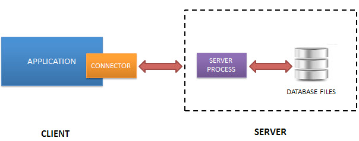
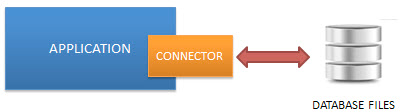
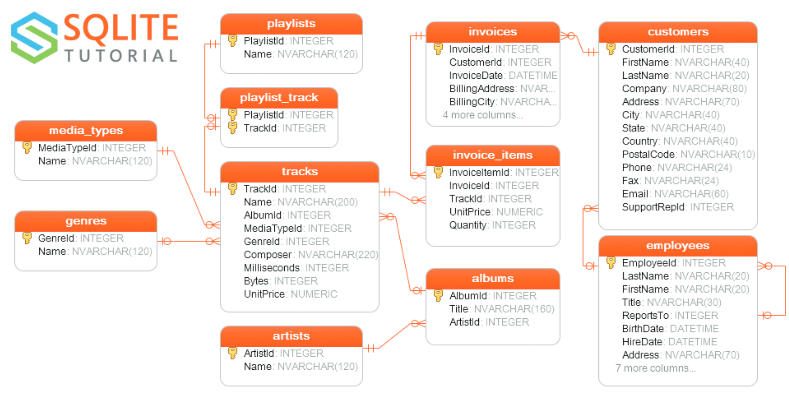

# Getting started with SQLite

[SQLite](http://www.sqlite.org) - A completely embedded, full-featured relational database in a few 100k that you can
include right into your project.

## What is SQLite

SQLite is a software library that provides a relational database management system. The lite in SQLite means lightweight
in terms of setup, database administration, and required resources.

SQLite has the following noticeable features: self-contained, serverless, zero-configuration, transactional.

### Serverless

Normally, an RDBMS such as MySQL, PostgreSQL, etc., requires a separate server process to operate. The applications that
want to access the database server use TCP/IP protocol to send and receive requests. This is called client/server
architecture.

The following diagram illustrates the RDBMS client/server architecture:



SQLite does NOT work this way.

SQLite does NOT require a server to run.

SQLite database is integrated with the application that accesses the database. The applications interact with the SQLite
database read and write directly from the database files stored on disk.

The following diagram illustrates the SQLite server-less architecture:



### Self-Contained

SQLite is self-contained means it requires minimal support from the operating system or external library. This makes
SQLite usable in any environment especially in embedded devices like iPhones, Android phones, game consoles, handheld
media players, etc.

SQLite is developed using ANSI-C. The source code is available as a big sqlite3.c and its header file sqlite3.h. If you
want to develop an application that uses SQLite, you just need to drop these files into your project and compile it with
your code.

### Zero-configuration

Because of the serverless architecture, you don’t need to “install” SQLite before using it. There is no server process
that needs to be configured, started, and stopped.

In addition, SQLite does not use any configuration files.

### Transactional

All transactions in SQLite are fully ACID-compliant. It means all queries and changes are Atomic, Consistent, Isolated,
and Durable.

In other words, all changes within a transaction take place completely or not at all even when an unexpected situation
like application crash, power failure, or operating system crash occurs.

## SQLite distinctive features

SQLite uses dynamic types for tables. It means you can store any value in any column, regardless of the data type.

SQLite allows a single database connection to access multiple database files simultaneously. This brings many nice
features like joining tables in different databases or copying data between databases in a single command.

SQLite is capable of creating in-memory databases that are very fast to work with.

## Download SQLite tools

To download SQLite, you open the [download page](https://www.sqlite.org/download.html) of the SQlite official website.

### official

1. go to the [https://www.sqlite.org](https://www.sqlite.org/) website.
2. open the download page [https://www.sqlite.org/download.html](https://www.sqlite.org/download.html)

SQLite provides various tools for working across platforms e.g., Windows, Linux, and Mac. You need to select an
appropriate version to download.

### homebrew

```shell
 brew install sqlite
```

## Run SQLite tools

1. type `sqlite3` and press enter, you should see the following output:

```shell
» sqlite3 
SQLite version 3.37.0 2021-12-09 01:34:53
Enter ".help" for usage hints.
Connected to a transient in-memory database.
Use ".open FILENAME" to reopen on a persistent database.
```

2. type the `.help` command from the sqlite> prompt to see all available commands in sqlite3.

```shell
sqlite> .help
.auth ON|OFF             Show authorizer callbacks
.backup ?DB? FILE        Backup DB (default "main") to FILE
.bail on|off             Stop after hitting an error.  Default OFF
.binary on|off           Turn binary output on or off.  Default OFF
.cd DIRECTORY            Change the working directory to DIRECTORY
```

3. to quit the sqlite>, you use `.quit` command as follows:

```shell
sqlite> .quit
```

## Install SQLite GUI tool

The sqlite3 shell is excellent

However, sometimes, you may want to work with the SQLite databases using an intuitive GUI tool.

There are many GUI tools for managing SQLite databases available ranging from freeware to commercial licenses.

- [DBeaver](https://dbeaver.io/) is a free multi-platform database tool. It supports all popular major relational
  database systems MySQL, PostgreSQL, Oracle, DB2, SQL Server, Sybase.. including SQLite.

```shell
 brew install --cask dbeaver-community 
```

## SQLite Sample Database

### Introduction to chinook SQLite sample database

The following database diagram illustrates the chinook database tables and their relationships.



### Chinook sample database tables

There are 11 tables in the chinook sample database.

- `employees` table stores employees data such as employee id, last name, first name, etc. It also has a field
  named `ReportsTo` to specify who reports to whom.
- `customers` table stores customers data.
- `invoices` & `invoice_items` tables: these two tables store invoice data. The `invoices` table stores invoice header
  data and the `invoice_items` table stores the invoice line items data.
- `artists` table stores artists data. It is a simple table that contains only the artist id and name.
- `albums` table stores data about a list of tracks. Each album belongs to one artist. However, one artist may have
  multiple albums.
- `media_types` table stores media types such as MPEG audio and AAC audio files.
- `genres` table stores music types such as rock, jazz, metal, etc.
- `tracks` table stores the data of songs. Each track belongs to one album.
- `playlists` & `playlist_track` tables: `playlists` table store data about playlists. Each playlist contains a list of
  tracks. Each track may belong to multiple playlists. The relationship between the `playlists` table and `tracks` table
  is many-to-many. The `playlist_track` table is used to reflect this relationship.

## How to connect to SQLite sample database

- use the following command to connect to the chinook sample database

```shell
sqlite3 chinook.db
```

- use `.tables` to view all the tables available in the sample database.

```shell
sqlite> .tables
albums          employees       invoices        playlists     
artists         genres          media_types     tracks        
customers       invoice_items   playlist_track
```

## SQLite Commands

### Connect to an SQLite database

To start the sqlite3, you type the sqlite3 as follows:

```shell
 » sqlite3                                                                                                                     
SQLite version 3.37.0 2021-12-09 01:34:53
Enter ".help" for usage hints.
Connected to a transient in-memory database.
Use ".open FILENAME" to reopen on a persistent database.
sqlite> 
```

By default, an SQLite session uses the in-memory database, therefore, all changes will be gone when the session ends.

To open a database file, you use the `.open FILENAME` command. The following statement opens the `chinook.db` database:

```shell
sqlite> .open chinook.db
```

If you want to open a specific database file when you connect to the SQlite database, you use the following command:

```shell
 » sqlite3 chinook.db                                                                                                         127 ↵ dutianze@bogon
SQLite version 3.37.0 2021-12-09 01:34:53
Enter ".help" for usage hints.
sqlite> 
```

If you start a session with a database name that does not exist, the sqlite3 tool will create the database file.

```shell
sqlite3 test.db
```

### Show all available commands and their purposes

To show all available commands and their purpose, you use the `.help` command as follows:

### Show databases in the current database connection

To show all databases in the current connection, you use the `.databases` command. The `.databases` command displays at
least one database with the name: `main`.

To add an additional database in the current connection, you use the statement ATTACH DATABASE. The following statement
adds the chinook database to the current connection.

```shell
sqlite> ATTACH DATABASE "chinook.db" AS chinook;
```

Now if you run the .database command again, the sqlite3 returns two databases: main and chinook.

### Exit sqlite3 tool

To exit the sqlite3 program, you use the `.exit` command. .

### Show tables in a database

To display all the tables in the current database, you use the `.tables` command. The following commands open a new
database connection to the chinook database and display the tables in the database.

```shell
sqlite> .tables
albums          employees       invoices        playlists     
artists         genres          media_types     tracks        
customers       invoice_items   playlist_track
```

If you want to find tables based on a specific pattern, you use the .table pattern command. The sqlite3 uses the LIKE
operator for pattern matching.

For example, the following statement returns the table that ends with the string es.

```shell
sqlite> .table '%es'
employees    genres       invoices     media_types
```

### Show the structure of a table

To display the structure of a table, you use the `.schema TABLE` command. The TABLE argument could be a pattern. If you
omit it, the .schema command will show the structures of all the tables.

```shell
sqlite> .schema albums
CREATE TABLE IF NOT EXISTS "albums"
(
    [AlbumId] INTEGER PRIMARY KEY AUTOINCREMENT NOT NULL,
    [Title] NVARCHAR(160)  NOT NULL,
    [ArtistId] INTEGER  NOT NULL,
    FOREIGN KEY ([ArtistId]) REFERENCES "artists" ([ArtistId]) 
                ON DELETE NO ACTION ON UPDATE NO ACTION
);
CREATE INDEX [IFK_AlbumArtistId] ON "albums" ([ArtistId]);
```

To show the schema and the content of the sqlite_stat tables, you use the `.fullschema` command.

### Show indexes

To show all indexes of the current database, you use the `.indexes` command as follows:

```shell
sqlite> .index
IFK_AlbumArtistId                  IFK_PlaylistTrackTrackId         
IFK_CustomerSupportRepId           IFK_TrackAlbumId                 
IFK_EmployeeReportsTo              IFK_TrackGenreId                 
IFK_InvoiceCustomerId              IFK_TrackMediaTypeId             
IFK_InvoiceLineInvoiceId           sqlite_autoindex_playlist_track_1
IFK_InvoiceLineTrackId
```

To show the indexes of a specific table, you use the `.indexes TABLE` command. For example, to show indexes of
the `albums` table, you use the following command:

```shell
sqlite> .index albums
IFK_AlbumArtistId
```

To show indexes of the tables whose names end with `es`, you use a pattern of
the [LIKE](https://www.sqlitetutorial.net/sqlite-like/) operator.

```shell
sqlite> .indexes %es
IFK_EmployeeReportsTo  IFK_InvoiceCustomerId
```

### Save the result of a query into a file

To save the result of a query into a file, you use the `.output FILENAME` command. Once you issue the `.output` command,
all the results of the subsequent queries will be saved to the file that you specified in the `FILENAME` argument. If
you want to save the result of the next single query only to the file, you issue the `.once FILENAME` command.

To display the result of the query to the standard `output` again, you issue the `.output` command without arguments.

The following commands select the `title` from the `albums` table and write the result to the `albums.txt` file.

### Execute SQL statements from a file

Suppose we have a file named `commands.txt` with the following content:

```shell
SELECT albumid, title
FROM albums
ORDER BY title
LIMIT 10;
```

To execute the SQL statements in the `commands.txt` file, you use the `.read FILENAME` command as follows:

```shell
sqlite> .mode column
sqlite> .header on
sqlite> .read c:/sqlite/commands.txt
AlbumId     Title
----------  ----------------------
156         ...And Justice For All
257         20th Century Masters -
296         A Copland Celebration,
94          A Matter of Life and D
95          A Real Dead One
96          A Real Live One
285         A Soprano Inspired
139         A TempestadeTempestade
203         A-Sides
160         Ace Of Spades
```

## References

1. [https://www.sqlite.org](https://www.sqlite.org/) – SQLite homepage
2. [https://www.sqlite.org/features.html](https://www.sqlite.org/features.html) – SQLite features
3. [https://www.sqlite.org/copyright.html](https://www.sqlite.org/copyright.html) – SQLite license
4. [https://www.sqlite.org/docs.html](https://www.sqlite.org/docs.html) – SQLite documentation
5. [https://www.sqlitetutorial.net](https://www.sqlitetutorial.net)
