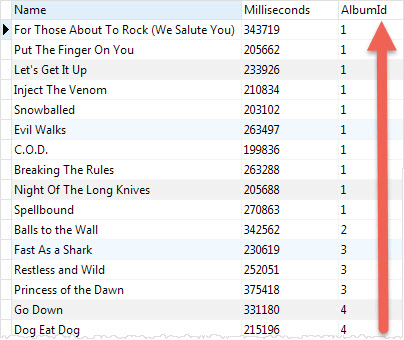
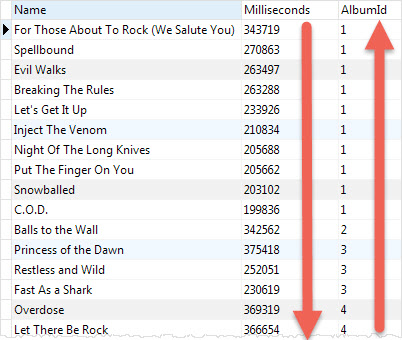
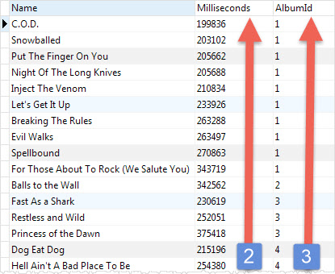
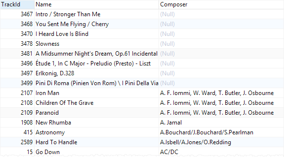
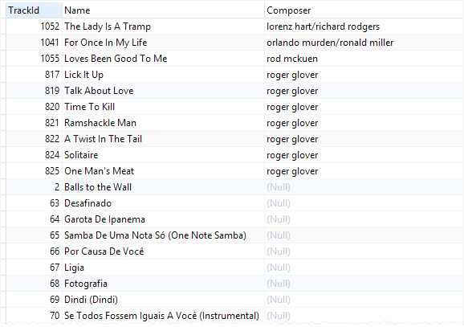
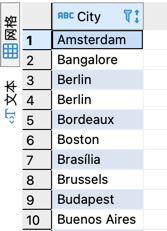
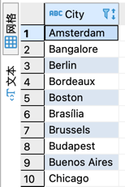
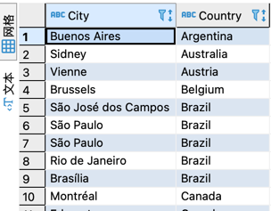
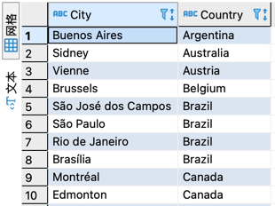

# SELECT

## Simple uses of SELECT statement

```shell
SELECT
	1 + 13;

SELECT
	10 / 5,
	2 * 4 ;
```

### Querying data from a table using the SELECT statement

```shell
SELECT DISTINCT column_list
FROM table_list
  JOIN table ON join_condition
WHERE row_filter
ORDER BY column
LIMIT count OFFSET offset
GROUP BY column
HAVING group_filter;
```

### Select basic

```shell
# get part columns from table
SELECT
	trackid,
	name,
	composer,
	unitprice
FROM
	tracks;
## get all columns from table
```

# Order By

```shell
SELECT
   select_list
FROM
   table
ORDER BY
    column_1 ASC,
    column_2 DESC;
```

## sort the result set based on AlbumId column in ascending order

```shell
SELECT
	name,
	milliseconds, 
	albumid
FROM
	tracks
ORDER BY
	albumid ASC;
# default is ASC
```



## sort the sorted result (by AlbumId) above by the Milliseconds column in descending order

```shell
SELECT
	name,
	milliseconds, 
	albumid
FROM
	tracks
ORDER BY
	albumid ASC;
```



## SQLite ORDER BY with the column position

the following statement sorts the tracks by both albumid (3rd column) and milliseconds (2nd column) in ascending order.

```shell
SELECT
	name,
	milliseconds, 
	albumid
FROM
	tracks
ORDER BY
	 3,2;
```



## Sorting NULLs

When it comes to sorting, SQLite considers NULL to be `smaller` than any other value.

SQLite 3.30.0 added the `NULLS FIRST` and `NULLS LAST` options to the `ORDER BY` clause. The `NULLS FIRST` option
specifies that the NULLs will appear at the beginning of the result set while the `NULLS LAST` option place NULLs at the
end of the result set.

The following example uses the ORDER BY clause to sort tracks by composers:

First, you see that NULLs appear at the beginning of the result set because SQLite treats them as the lowest values.
When you scroll down the result, you will see other values:

```shell
SELECT
	TrackId,
	Name,
	Composer
FROM
	tracks
ORDER BY
	Composer ;
```



The following example uses the NULLS LAST option to place NULLs after other values:

If you scroll down the output, you will see that NULLs are placed at the end of the result set:


# DISTINCT

The `DISTINCT` clause allows you to remove the duplicate rows in the result set.

SQLite considers NULL values as duplicates. If you use theDISTINCT clause with a column that has NULL values, SQLite
will keep one row of a NULL value.

```shell
SELECT DISTINCT	select_list
FROM table;
```

## SELECT DISTINCT on one column

Suppose you want to know the cities where the customers locate, you can use the SELECT statement to get data from the
city column of the customers table as follows:

```shell
SELECT city
FROM customers
ORDER BY city;
```


It returns 59 rows. There are few duplicate rows such as Berlin London, and Mountain View To remove these duplicate
rows, you use the DISTINCT clause as follows:

```shell
SELECT
	DISTINCT city
FROM
	customers
ORDER BY
	city;
```



## SELECT DISTINCT on multiple columns

The following statement finds cities and countries of all customers.



The result set contains duplicate city and country e.g., Sao Paulo in Brazil as shown in the screenshot above.

To remove duplicate the city and country, you apply the DISTINCT clause to both city and country columns as shown in the
following query:

```shell
SELECT
	DISTINCT 
	city,
	country
FROM
	customers
ORDER BY
	country;
```



# WHERE

```shell
SELECT
	column_list
FROM
	table
WHERE
	search_condition;
	
search_condition: left_expression COMPARISON_OPERATOR right_expression
eg.
WHERE column_1 = 100;

WHERE column_2 IN (1,2,3);

WHERE column_3 LIKE 'An%';

WHERE column_4 BETWEEN 10 AND 20;
```

## comparison operator

A comparison operator tests if two expressions are the same. The following table illustrates the comparison operators
that you can use to construct expressions:

|  Operator   | Meaning  |
|  ----  | ----  |
| =  | Equal to |
| <> or !=  | Not equal to |
| < | Less than |
| \> | Greater than |
| <= | Less than or equal to |
| > = | Greater than or equal to |

the following query uses the WHERE clause the equality operator to find all the tracks in the album id 1:

```shell
SELECT
	name,
	milliseconds,
	bytes,
	albumid
FROM
	tracks
WHERE
	albumid = 1;
```

## logical operators

| Operator                                                  | Meaning                                                                             |
| ----------------------------------------------------------- | ------------------------------------------------------------------------------------- |
| ALL                                                       | returns 1 if all expressions are 1.                                                 |
| AND                                                       | returns 1 if both expressions are 1, and 0 if one of the expressions is 0.          |
| ANY                                                       | returns 1 if any one of a set of comparisons is 1.                                  |
| BETWEEN | returns 1 if a value is within a range.         |
| EXISTS   | returns 1 if a subquery contains any rows.     |
| IN        | returns 1 if a value is in a list of values.  |
| LIKE       | returns 1 if a value matches a pattern       |
| NOT                                                       | reverses the value of other operators such as NOT EXISTS, NOT IN, NOT BETWEEN, etc. |
| OR                                                        | returns true if either expression is 1                                              |

get tracks of the album 1 that have the length greater than 200,000 milliseconds, you use the following statement:

```shell
SELECT
	name,
	milliseconds,
	bytes,
	albumid
FROM
	tracks
WHERE
	albumid = 1
	AND milliseconds > 200000;
```

## LIKE operator

find which tracks composed by Smith, you use the LIKE operator as follows:

```shell
SELECT
	name,
	albumid,
	composer
FROM
	tracks
WHERE
	composer LIKE '%Smith%'
ORDER BY
	albumid;
	
```

## IN operator

ind tracks that have media type id is 2 or 3, you use the IN operator as shown in the following statement:

```shell
SELECT
	name,
	albumid,
	mediatypeid
FROM
	tracks
WHERE
	mediatypeid IN (2, 3);
```

# LIMIT

The LIMIT clause is an optional part of the SELECT statement. You use the LIMIT clause to constrain the number of rows
returned by the query.

```shell
SELECT
	column_list
FROM
	table
LIMIT row_count;
```

get the first 10 rows in the tracks table, you use the following statement:

```shell
SELECT
	trackId,
	name
FROM
	tracks
LIMIT 10;
```

If you want to get the first 10 rows starting from the 10th row of the result set, you use `OFFSET` keyword as the
following:

```shell
SELECT
	column_list
FROM
	table
LIMIT row_count OFFSET offset;

```

## OFFSET

shorthand syntax of the LIMIT OFFSET clause:

```shell

SELECT
	column_list
FROM
	table
LIMIT offset, row_count;
```

get 10 rows starting from the 11th row in the tracks table

```shell
SELECT
	trackId,
	name
FROM
	tracks
LIMIT 10 OFFSET 10;
```

## LIMIT and ORDER BY

You should always use the `LIMIT` clause with the  `ORDER BY` clause. Because you want to get a number of rows in a
specified order, not in an unspecified order.

```shell
SELECT
   column_list
FROM
   table
ORDER BY column_1
LIMIT row_count;
```

get the top 10 biggest tracks by size, you use the following query:

```shell
SELECT
	trackid,
	name,
	bytes
FROM
	tracks
ORDER BY
	bytes DESC
LIMIT 10;
```

## Getting the nth highest and the lowest value

The following statement returns the second-longest track in the tracks table.

```shell
SELECT
	trackid,
	name,
	milliseconds
FROM
	tracks
ORDER BY
	milliseconds DESC
LIMIT 1 OFFSET 1;
```

# BETWEEN

The `BETWEEN` operator is a logical operator that tests whether a value is in range of values. If the value is in the
specified range, the `BETWEEN` operator returns true. The `BETWEEN` operator can be used in the `WHERE` clause of
the `SELECT`, `DELETE`, `UPDATE`, and `REPLACE` statements.

```shell
test_expression BETWEEN low_expression AND high_expression

test_expression >= low_expression AND test_expression <= high_expression
```

To negate the result of the `BETWEEN` operator, you use the `NOT BETWEEN` operator as follows:

```shell
test_expression NOT BETWEEN low_expression AND high_expression

test_expression < low_expression OR test_expression > high_expression
```

## BETWEEN numeric values

The following statement finds invoices whose total is between 14.96 and 18.86:

```shell
SELECT
	InvoiceId,
	BillingAddress,
	Total
FROM
	invoices
WHERE
	Total BETWEEN 14.91 and 18.86
ORDER BY
	Total;
```

## NOT BETWEEN numeric values

To find the invoices whose total are not between 1 and 20, you use the NOT BETWEEN operator as shown in the following
query:

```shell
SELECT
    InvoiceId,
    BillingAddress,
    Total
FROM
    invoices
WHERE
    Total NOT BETWEEN 1 and 20
ORDER BY
    Total;    
```

## BETWEEN dates

The following example finds invoices whose invoice dates are from `January 1 2010` and `January 31 2010`:

```shell
SELECT
    InvoiceId,
    BillingAddress,
    InvoiceDate,
    Total
FROM
    invoices
WHERE
    InvoiceDate BETWEEN '2010-01-01' AND '2010-01-31'
ORDER BY
    InvoiceDate;    
```

# IN

## IN

The SQLite `IN` operator determines whether a value matches any value in a list or a subquery. The syntax of the `IN`
operator is as follows:

```shell
expression [NOT] IN (value_list|subquery);
```

The following statement uses the `IN` operator to query the tracks whose media type id is 1 or 2.

```shell
SELECT
	TrackId,
	Name,
	Mediatypeid
FROM
	Tracks
WHERE
	MediaTypeId IN (1, 2)
ORDER BY
	Name ASC;
```

To get the tracks that belong to the artist id 12, you can combine the IN operator with a subquery as follows:

```shell
SELECT
	TrackId, 
	Name, 
	AlbumId
FROM
	Tracks
WHERE
	AlbumId IN (
		SELECT
			AlbumId
		FROM
			Albums
		WHERE
			ArtistId = 12
	);
```

## NOT IN

The following statement returns a list of tracks whose genre id is not in a list of (1,2,3).

```shell
SELECT
	trackid,
	name,
	genreid
FROM
	tracks
WHERE
	genreid NOT IN (1, 2,3);
```

# LIKE

```shell
SELECT
	column_list
FROM
	table_name
WHERE
	column_1 LIKE pattern;
```

SQLite provides two wildcards for constructing patterns. They are percent sign `%` and underscore `_` :

1. The percent sign `%` wildcard matches any sequence of zero or more characters.
2. The underscore `_` wildcard matches any single character.

## LIKE

find the tracks whose names start with the Wild literal string, you use the percent sign % wildcard at the end of the
pattern.

```shell
SELECT
	trackid,
	name	
FROM
	tracks
WHERE
	name LIKE 'Wild%'
```

## ESCAPE

```shell
SELECT c 
FROM t 
WHERE c LIKE '%10\%%' ESCAPE '\';
```

# GLOB

# IS NULL


