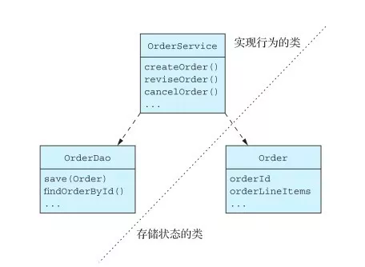

## doc

图1 Order Service具有六边形架构。它由业务逻辑和一个或多个与其他服务和外部应用程序连接的适配器组成

图1显示了一个典型的服务架构。业务逻辑是六边形架构的核心。业务逻辑的周围是入站和出站适配器。
入站适配器处理来自客户端的请求并调用业务逻辑。出站适配器被业务逻辑调用，然后它们再调用其他服务和外部应用程序。

此服务由业务逻辑和以下适配器组成。  
REST API adapter：入站适配器，实现REST API，这些API会调用业务逻辑。  
OrderCommandHandlers：入站适配器，它接收来自消息通道的命令式消息，并调用业务逻辑。  
Database Adapter：由业务逻辑调用以访问数据库的出站适配器。  
Domain Event Publishing Adapter：将事件发布到消息代理的出站适配器。

业务逻辑通常是服务中最复杂的部分。在开发业务逻辑时，你应该以最适合应用程序的方式，精心地设计和组织业务逻辑。 我确信大多数读者都经历过不得不维护别人的糟糕代码的挫败感。
大多数企业应用程序都是用面向对象的语言编写的，例如Java，因此它们由类和方法组成。 但是使用面向对象的语言并不能保证业务逻辑具有面向对象的设计。
在开发业务逻辑时必须做出的关键决策是选用面向对象的方式，还是选用面向过程的方式。 组织业务逻辑有两种主要模式：面向过程的事务脚本模式和面向对象的领域建模模式。

## 1　使用事务脚本模式设计业务逻辑

虽然我一直积极地倡导使用面向对象的方式，但在某些情况下使用面向对象的设计方法会有一种“杀鸡用牛刀”的感觉，例如在开发简单的业务逻辑时。
在这种情况下，更好的方法是编写面向过程的代码，并使用Martin Fowler在《Patterns of EnterpriseApplication Architecture》一书中提到的事务脚本模式。
你可以编写一个称为事务脚本的方法来处理来自表示层的每个请求，而不是进行任何面向对象的设计。
如图2所示，这种方法的一个重要特征是实现行为的类与存储状态的类是分开的。

图2 将业务逻辑组织为事务脚本。在典型的基于事务脚本的设计中，一组类实现行为，另一组类负责存储状态。 事务脚本通常被写成没有状态的类。脚本访问没有行为的数据类以完成持久化的任务

使用事务脚本模式时，脚本通常位于服务类中，在此示例中是OrderService类。每个服务类都有一个用于请求或系统操作的方法。这个方法实现该请求的业务逻辑。
它使用数据访问对象（DAO）访问数据库，例如OrderDao。数据对象（在此示例中为Order类）是纯数据，几乎没有行为。

这种设计风格是高度面向过程的，仅仅依赖于面向对象编程（OOP）语言的少量功能。就好比你使用C或其他非OOP语言编写应用所能实现的功能。
然而，在适当的时候，你不应该羞于使用面向过程的设计。这种方法适用于简单的业务逻辑。但这往往不是实现复杂业务逻辑的好方法。

## 2　使用领域模型模式设计业务逻辑

面向过程方法的可以简单迅速地搞定项目，这非常诱人。你可以专注编写业务逻辑代码，而无须仔细考虑如何设计和组织各种类。
但是问题在于，如果业务逻辑变得复杂，你最终可能会得到噩梦般难以维护的代码。实际上，就像单体应用程序不断增长的趋势一样，事务脚本也存在同样的问题。
因此，除非是编写一个非常简单的应用程序，否则你应该抵制编写面向过程代码的诱惑，使用领域模型模式，并进行面向对象的设计。

在面向对象的设计中，业务逻辑由对象模型和相对较小的一些类的网络组成。这些类通常直接对应于问题域中的概念。
在这样的设计中，有些类只有状态或行为，但很多类同时包含状态和行为，这样的类都是精心设计的。图3显示了领域模型模式的示例。

图3 将业务逻辑组织为领域模型。大多数业务逻辑由具有状态和行为的类组成

与事务脚本模式一样，OrderService类具有针对每个请求或系统操作的方法。但是在使用领域模型模式时，服务方法通常很简单, 因为服务方法几乎总是调用持久化领域对象，这些对象中包含大量的业务逻辑。
例如，服务方法可以从数据库加载领域对象并调用其中一个方法。在这个例子中，Order类具有状态和行为。 此外，它的状态是私有的，只能通过它的方法间接访问。

使用面向对象设计有许多好处。首先，这样的设计易于理解和维护。它不是由一个完成所有事情的大类组成，而是由许多小类组成，每个小类都有少量职责。
此外，诸如Account、BankingTransaction和OverdraftPolicy这些类都密切地反映了现实世界，这使得它们在设计中的角色更容易理解。
其次，我们的面向对象设计更容易测试：每个类都可以并且应该能够被独立测试。
最后，面向对象的设计更容易扩展，因为它可以使用众所周知的设计模式，例如策略模式（Strategy pattern）和模板方法模式（Template methodpattern），这些设计模式定义了在不修改代码的情况下扩展组件的方法。

领域建模模式看似完美，但这种方法同样也存在许多问题，尤其是在微服务架构中。要解决这些问题，你需要使用称为领域驱动设计的思路来优化面向对象设计。

## 3　关于领域驱动设计

领域驱动设计（Domain-Driven Design，DDD）的概念产生于Eric Evans写的《Domain Driven Design》一书，DDD是对面向对象设计的改进，是开发复杂业务逻辑的一种方法。
我在第2章介绍过DDD，领域驱动设计的子域概念有助于把应用程序分解为服务。使用DDD时，每个服务都有自己的领域模型，这就避免了在单个应用程序全局范围内的领域模型问题。
子域和相关联的限界上下文的相关概念是两种战略性DDD模式。

DDD还有一些战术性模式，它们是领域模型的基本元素（building block）。每个模式都是一个类在领域模型中扮演的角色，并定义了类的特征。开发人员广泛采用的基本元素包括以下几种。

- 实体（entity）：具有持久化ID的对象。具有相同属性值的两个实体仍然是不同的对象。在Java EE应用程序中，使用JPA @Entity进行持久化的类通常是DDD实体。
- 值对象（value object）：作为值集合的对象。具有相同属性值的两个值对象可以互换使用。值对象的一个例子是Money类，它由币种和金额组成。
- 工厂（factory）：负责实现对象创建逻辑的对象或方法，该逻辑过于复杂，无法由类的构造函数直接完成。它还可以隐藏被实例化的具体类。工厂方法一般可实现为类的静态方法。
- 存储库（repository）：用来访问持久化实体的对象，存储库也封装了访问数据库的底层机制。
- 服务（service）：实现不属于实体或值对象的业务逻辑的对象。

许多开发人员都使用这些基本元素，有些基本元素是通过JPA和Spring框架等实现的。
除了DDD纯粹主义者之外，还有一个被众人（包括我在内）忽略的基本元素：聚合。
事实证明，在开发微服务时，聚合是一个非常有用的概念。在下一部分，我们来看一看，聚合如何解决经典面向对象设计的一些微妙问题。

## Credits

* [微服务架构：从事务脚本到领域模型](https://developer.aliyun.com/article/718968)