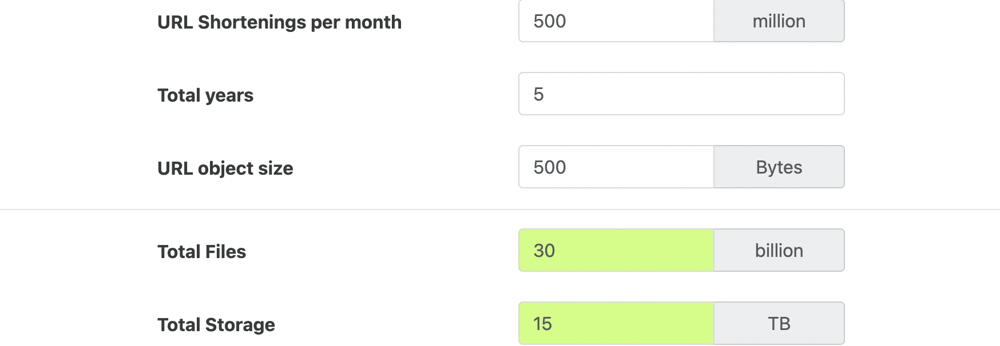
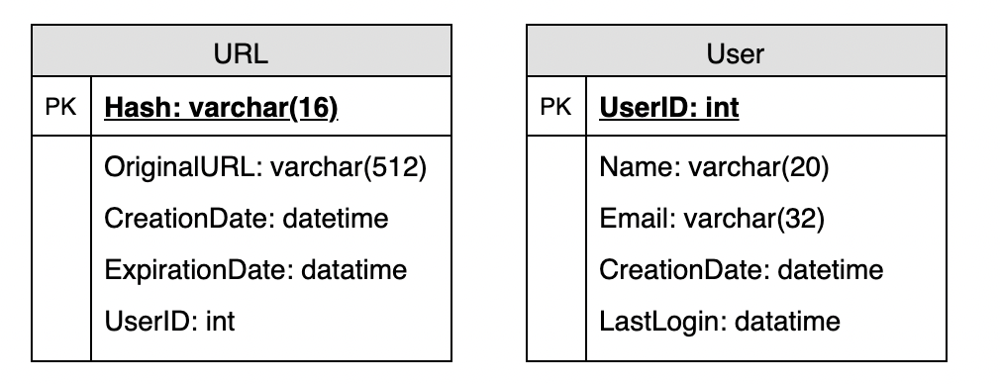
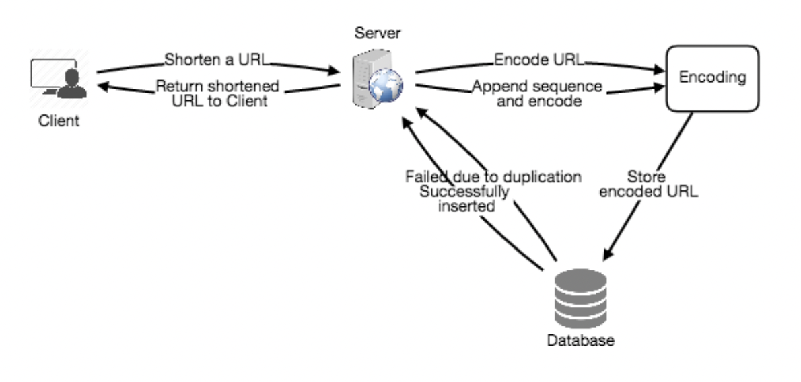
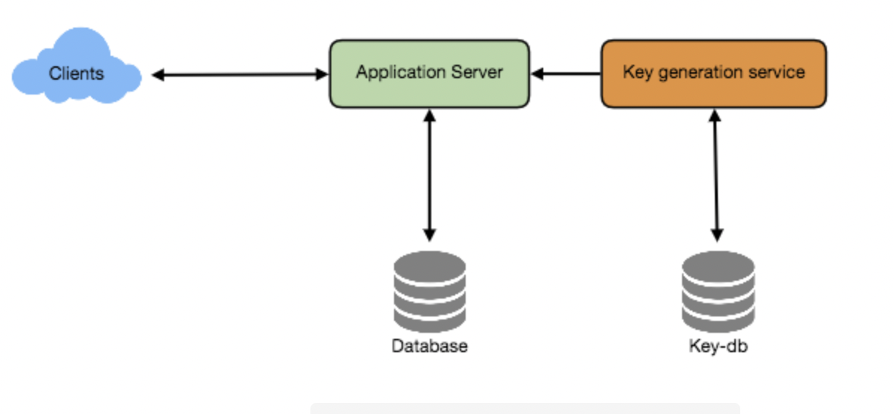
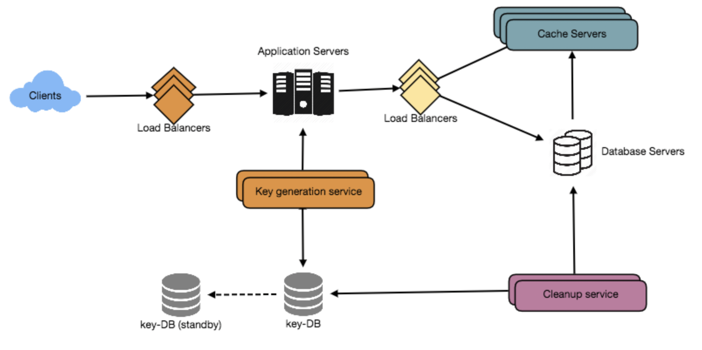

# 设计一个像 TinyURL 这样的网址缩短服务

Let's design a URL shortening service like TinyURL. 

This service will provide short aliases redirecting to long URLs. Similar services: bit.ly, goo.gl, qlink.me, etc. 

Difficulty Level: Easy

让我们设计一个像 TinyURL 这样的网址缩短服务。

这个服务将提供短的别名重定向到长的网址。 

类似的服务: bit.ly、 goo.gl、 qlink.me 等。 

难度等级: 简单

## 1\. Why do we need URL shortening? 为什么我们需要网址缩短？

URL shortening is used to create shorter aliases for long URLs. We call these shortened aliases “short links.” Users are redirected to the original URL when they hit these short links. Short links save a lot of space when displayed, printed, messaged, or tweeted. Additionally, users are less likely to mistype shorter URLs.

URL 缩短用于为长 URL 创建较短的别名。我们称这些缩写的别名为“短链接”当用户点击这些短链接时，会被重定向到原始 URL。短链接节省了大量的空间时，显示，打印，消息，或推特。此外，用户不太可能键入错误的短网址。

For example, if we shorten this page through TinyURL:

例如，如果我们通过 TinyURL 缩短这个页面:

> https://tenri.duckdns.org/posts/cbe2e0fe7279/#%E8%A1%A8%E8%BE%BE%E5%81%9A%E6%9F%90%E4%BA%8B%E7%9A%84%E8%83%BD%E5%8A%9B

We would get:

我们会得到:

> https://tinyurl.com/2p8x33kf

The shortened URL is nearly one-third the size of the actual URL.

缩短后的 URL 几乎是实际 URL 的三分之一。

URL shortening is used for optimizing links across devices, tracking individual links to analyze audience and campaign performance, and hiding affiliated original URLs.

URL 缩短用于优化设备之间的链接，跟踪单个链接以分析受众和活动表现，并隐藏附属的原始 URL。

If you haven’t used [tinyurl.com](http://tinyurl.com/) before, please try creating a new shortened URL and spend some time going through the various options their service offers. This will help you a lot in understanding this chapter.

如果你以前没有使用过 tinyurl.com，请尝试创建一个新的网址缩写，并花一些时间浏览他们的服务提供的各种选项。这将有助于你理解这一章。

## 2\. Requirements and Goals of the System 系统的要求和目标

💡 You should always clarify requirements at the beginning of the interview. Be sure to ask questions to find the exact scope of the system that the interviewer has in mind. 

你应该在面试一开始就说明要求。一定要问问题，找出面试官心目中的系统的确切范围

Our URL shortening system should meet the following requirements:

我们的网址缩短系统应符合以下要求:

**Functional Requirements:** 功能要求

1. Given a URL, our service should generate a shorter and unique alias of it. This is called a short link. This link should be short enough to be easily copied and pasted into applications. 给定一个 URL，我们的服务应该生成一个更短和唯一的别名。这就是所谓的短链接。这个链接应该足够短，以便于复制和粘贴到应用程序中
2. When users access a short link, our service should redirect them to the original link. 当用户访问短链接时，我们的服务应该将他们重定向到原始链接
3. Users should optionally be able to pick a custom short link for their URL. 用户应该可以选择为他们的 URL 选择一个自定义短链接
4. Links will expire after a standard default timespan. Users should be able to specify the expiration time. 链接将在标准默认时间跨度之后过期。用户应该能够指定过期时间

**Non-Functional Requirements:** 非功能要求

1. The system should be highly available. This is required because, if our service is down, all the URL redirections will start failing. 系统应该是高度可用的。这是必需的，因为如果我们的服务关闭，所有 URL 重定向将开始失败
2. URL redirection should happen in real-time with minimal latency. URL 重定向应该以最小的延迟实时发生
3. Shortened links should not be guessable (not predictable). 缩短的链接不应该是可猜测的(不可预测的)

**Extended Requirements:** 扩展要求

1. **Analytics**; e.g., how many times a redirection happened? 分析; 例如，重定向发生了多少次？
2. Our service should also be accessible through REST APIs by other services. 我们的服务也应该可以被其他服务通过 REST API 访问

## 3\. Capacity Estimation and Constraints  能力评估和制约因素

Our system will be read-heavy. There will be lots of redirection requests compared to new URL shortenings. Let’s assume a 100:1 ratio between read and write.

我们的系统会读取操作频繁。与新的 URL 缩短相比，将会有大量的重定向请求。让我们假设读写之间的比例为100:1。

**Traffic estimates:** Assuming, we will have 500M new URL shortenings per month, with 100:1 read/write ratio, we can expect 50B redirections during the same period:

流量估计: 假设我们每个月有5亿个新的网址缩短，读/写比例为100:1，我们可以期望在同一时期有50B 的重定向:

> 100 \* 500M => 50B

What would be Queries Per Second (QPS) for our system? New URLs shortenings per second:

我们的系统的每秒查询量是多少? 每秒新网址缩短:

> 500 million / (30 days \* 24 hours \* 3600 seconds) = ~200 URLs/s 

Considering 100:1 read/write ratio, URLs redirections per second will be:

考虑到100:1的读/写比率，URL 每秒的重定向将是:

> 100 \* 200 URLs/s = 20K/s 100 \* 200个 URL/s = 20K/s

**Storage estimates:** Let’s assume we store every URL shortening request (and associated shortened link) for 5 years. Since we expect to have 500M new URLs every month, the total number of objects we expect to store will be 30 billion:

存储估算: 假设我们将每个 URL 缩短请求(以及相关的缩短链接)存储5年。因为我们期望每个月有5亿个新的 URL，我们期望存储的对象总数将达到300亿:

> 500 million \* 5 years \* 12 months = 30 billion 

Let’s assume that each stored object will be approximately 500 bytes (just a ballpark estimate–we will dig into it later). We will need 15TB of total storage:

让我们假设每个存储对象大约是500字节(这只是一个大致的估计——稍后我们将深入研究)。我们将需要15TB 的总存储量:

> 30 billion \* 500 bytes = 15 TB 



**Bandwidth estimates:** For write requests, since we expect 200 new URLs every second, total incoming data for our service will be 100KB per second:

带宽估计: 对于写请求，因为我们预计每秒钟有200个新的 URL，所以我们服务的总传入数据将是每秒100KB:

> 200 \* 500 bytes = 100 KB/s

For read requests, since every second we expect ~20K URLs redirections, total outgoing data for our service would be 10MB per second:

对于读请求，由于我们预计每秒钟约20K 的 URL 重定向，我们服务的总传出数据将是每秒10MB:

> 20K \* 500 bytes = ~10 MB/s 

**Memory estimates:** If we want to cache some of the hot URLs that are frequently accessed, how much memory will we need to store them? If we follow the 80-20 rule, meaning 20% of URLs generate 80% of traffic, we would like to cache these 20% hot URLs.

内存评估: 如果我们想要缓存一些经常访问的热门 URL，需要存储多少内存？如果我们遵循80-20规则，这意味着20% 的 URL 产生80% 的流量，我们希望缓存这些20% 的热 URL。

Since we have 20K requests per second, we will be getting 1.7 billion requests per day:

因为我们每秒有2万个请求，所以我们每天会收到17亿个请求:

> 20K \* 3600 seconds \* 24 hours = ~1.7 billion 

To cache 20% of these requests, we will need 170GB of memory.

要缓存这些请求中的20% ，我们将需要170GB 内存。

> 0.2 \* 1.7 billion \* 500 bytes = ~170GB 

One thing to note here is that since there will be a lot of duplicate requests (of the same URL), therefore, our actual memory usage will be less than 170GB.

这里需要注意的一点是，由于将会有许多重复请求(同一个 URL) ，因此，我们的实际内存使用将少于170GB。

**High level estimates:** Assuming 500 million new URLs per month and 100:1 read:write ratio, following is the summary of the high level estimates for our service:

高级别估计: 假设每月新增5亿个 URL 和100:1的读写比率，以下是我们服务的高级别估计的摘要:


## 4\. System APIs 系统 API

💡      Once we've finalized the requirements, it's always a good idea to define the system APIs. This should explicitly state what is expected from the system. 

一旦我们确定了需求，定义系统 API 总是一个好主意。这应该明确地说明对系统的期望是什么

We can have SOAP or REST APIs to expose the functionality of our service. Following could be the definitions of the APIs for creating and deleting URLs:

我们可以使用 SOAP 或 REST API 来公开服务的功能。以下可能是用于创建和删除 URL 的 API 的定义:

```java
createURL(api_dev_key, original_url, custom_alias=None, user_name=None, expire_date=None)
```

**Parameters:**
api_dev_key (string): The API developer key of a registered account. This will be used to, among other things, throttle users based on their allocated quota.
original_url (string): Original URL to be shortened.
custom_alias (string): Optional custom key for the URL.
user_name (string): Optional user name to be used in the encoding.
expire_date (string): Optional expiration date for the shortened URL.

**Returns:** (string) 
A successful insertion returns the shortened URL; otherwise, it returns an error code.

返回: (字符串)成功插入将返回缩短后的 URL; 否则，将返回错误代码。

```
deleteURL(api_dev_key, url_key)
```

Where “url\_key” is a string representing the shortened URL to be retrieved. A successful deletion returns ‘URL Removed’.

其中“ URL \_ key”是一个表示要检索的缩短 URL 的字符串。成功删除将返回“ URL 已删除”。

**How do we detect and prevent abuse?** A malicious user can put us out of business by consuming all URL keys in the current design. To prevent abuse, we can limit users via their api\_dev\_key. Each api\_dev\_key can be limited to a certain number of URL creations and redirections per some time period (which may be set to a different duration per developer key).

我们如何发现和防止滥用？恶意用户可以通过使用当前设计中的所有 URL 密钥使我们破产。为了防止滥用，我们可以通过 api \_ dev \_ key 限制用户。每个 api \_ dev \_ key 可以被限制为每个时间段内创建一定数量的 URL 和重定向(可以为每个开发人员密钥设置不同的持续时间)。

## 5\. Database Design  数据库设计

💡      Defining the DB schema in the early stages of the interview would help to understand the data flow among various components and later would guide towards data partitioning. 

在面试的早期阶段定义 DB 模式将有助于理解各个组件之间的数据流，并在以后指导数据分区

A few observations about the nature of the data we will store: 关于我们将要存储的数据性质的一些观察:

1. We need to store billions of records. 我们需要存储数十亿的记录
2. Each object we store is small (less than 1K). 我们存储的每个对象都很小(小于1K)
3. There are no relationships between records—other than storing which user created a URL. 记录之间没有关系ーー除了存储哪个用户创建了 URL 之外
4. Our service is read-heavy. 我们的服务读数很多

Database Schema 数据库架构:

We would need two tables: one for storing information about the URL mappings, and one for the user’s data who created the short link.

我们需要两个表: 一个用于存储关于 URL 映射的信息，另一个用于创建短链接的用户的数据。



**What kind of database should we use?** Since we anticipate storing billions of rows, and we don’t need to use relationships between objects – a NoSQL store like [DynamoDB](https://en.wikipedia.org/wiki/Amazon_DynamoDB), [Cassandra](https://en.wikipedia.org/wiki/Apache_Cassandra) or [Riak](https://en.wikipedia.org/wiki/Riak) is a better choice. A NoSQL choice would also be easier to scale. Please see [SQL vs NoSQL](https://www.educative.io/courses/system-design-basics/sql-vs-nosql.html) for more details.

我们应该使用什么类型的数据库？因为我们预期存储数十亿行，而且我们不需要使用对象之间的关系——像 DynamoDB、 Cassandra 或 Riak 这样的 NoSQL 存储是更好的选择。NoSQL 选项也更容易扩展。有关详细信息，请参阅 SQL vs NoSQL。

## 6\. Basic System Design and Algorithm  基本系统设计与算法

The problem we are solving here is, how to generate a short and unique key for a given URL.

我们在这里要解决的问题是，如何为给定的 URL 生成一个简短而唯一的密钥。

In the TinyURL example in Section 1, the shortened URL is "https://tinyurl.com/2p8x33kf" The last seven characters of this URL is the short key we want to generate. We’ll explore two solutions here:

在第一部分的 TinyURL 例子中，缩短后的 URL 是"https://tinyurl.com/2p8x33kf"。这个 URL 的最后七个字符是我们想要生成的短键。我们将在这里探讨两种解决方案:

### a. Encoding actual URL 编码实际的 URL

We can compute a unique hash (e.g., [MD5](https://en.wikipedia.org/wiki/MD5) or [SHA256](https://en.wikipedia.org/wiki/SHA-2), etc.) of the given URL. The hash can then be encoded for displaying. This encoding could be base36 (\[a-z ,0-9\]) or base62 (\[A-Z, a-z, 0-9\]) and if we add ‘+’ and ‘/’ we can use [Base64](https://en.wikipedia.org/wiki/Base64#Base64_table) encoding. A reasonable question would be, what should be the length of the short key? 6, 8, or 10 characters?

我们可以计算给定 URL 的唯一散列(例如 MD5或 SHA256等)。然后可以对哈希进行编码以便显示。这种编码可以是 base36(\[ A-Z，0-9\])或 base62(\[ A-Z，a-z，0-9\]) ，如果我们添加“ +”和“/”，我们可以使用 Base64编码。一个合理的问题是，短键的长度应该是多少？68还是10个字符？

- Using base64 encoding, a 6 letters long key would result in 64^6 = ~68.7 billion possible strings 使用 base64编码，一个6个字母的长键将产生64 ^ 6 = ~ 687亿个可能的字符串。

- Using base64 encoding, an 8 letters long key would result in 64^8 = ~281 trillion possible strings 使用 base64编码，一个8个字母的长键将产生64 ^ 8 = ~ 281万亿个可能的字符串

With 68.7B unique strings, let’s assume six letter keys would suffice for our system.

使用68.7 B 的唯一字符串，我们假设6个字母键对于我们的系统来说就足够了。

If we use the MD5 algorithm as our hash function, it’ll produce a 128-bit hash value. After base64 encoding, we’ll get a string having more than 21 characters (since each base64 character encodes 6 bits of the hash value). Now we only have space for 8 characters per short key, how will we choose our key then? We can take the first 6 (or 8) letters for the key. This could result in key duplication, to resolve that, we can choose some other characters out of the encoding string or swap some characters.

如果我们使用 MD5算法作为散列函数，它将产生一个128位的散列值。在 base64编码之后，我们将得到一个包含21个以上字符的字符串(因为每个 base64字符编码6位散列值)。现在我们只有8个字符的空间每个短键，我们将如何选择我们的键呢？我们可以取前6个(或8个)字母作为密钥。这可能导致键重复，为了解决这个问题，我们可以从编码字符串中选择一些其他字符或交换一些字符。

**What are the different issues with our solution?** We have the following couple of problems with our encoding scheme:

我们的解决方案有哪些不同的问题? 我们的编码方案有以下几个问题:

1. If multiple users enter the same URL, they can get the same shortened URL, which is not acceptable. 如果多个用户输入相同的 URL，他们可以得到相同的缩短 URL，这是不可接受的
2. What if parts of the URL are URL-encoded? e.g.,[http://www.educative.io/distributed.php?id=design](http://www.educative.io/distributed.php?id=design), and [http://www.educative.io/distributed.php%3Fid%3Ddesign](http://www.educative.io/distributed.php%3Fid%3Ddesign) are identical except for the URL encoding.  如果 URL 的某些部分是 URL 编码的怎么办

**Workaround for the issues:** We can append an increasing sequence number to each input URL to make it unique, and then generate a hash of it. We don’t need to store this sequence number in the databases, though. Possible problems with this approach could be an ever-increasing sequence number. Can it overflow? Appending an increasing sequence number will also impact the performance of the service.

解决问题的方法: 我们可以在每个输入 URL 后面附加一个增加的序列号，使其唯一，然后生成一个散列。但是，我们不需要在数据库中存储这个序列号。这种方法可能存在的问题是序列号不断增加。会溢出来吗？追加一个增加的序列号也会影响服务的性能。

Another solution could be to append user id (which should be unique) to the input URL. However, if the user has not signed in, we would have to ask the user to choose a uniqueness key. Even after this, if we have a conflict, we have to keep generating a key until we get a unique one.

另一种解决方案是将用户 id (应该是唯一的)附加到输入 URL。但是，如果用户尚未登录，我们将不得不要求用户选择唯一性键。即使在这之后，如果我们有一个冲突，我们必须继续生成一个密钥，直到我们得到一个唯一的。



### b. Generating keys offline 脱机生成密钥

We can have a standalone **Key Generation Service (KGS)** that generates random six-letter strings beforehand and stores them in a database (let’s call it key-DB). Whenever we want to shorten a URL, we will just take one of the already-generated keys and use it. This approach will make things quite simple and fast. Not only are we not encoding the URL, but we won’t have to worry about duplications or collisions. KGS will make sure all the keys inserted into key-DB are unique

我们可以有一个独立的密钥生成服务(KGS) ，它可以预先生成随机的六个字母字符串，并将它们存储在数据库中(让我们称之为 Key-DB)。无论什么时候我们想要缩短一个 URL，我们只需要获取一个已经生成的键并使用它。这种方法将使事情变得非常简单和快速。我们不仅不对 URL 进行编码，而且也不必担心重复或冲突。KGS 将确保插入到 key-DB 中的所有键都是唯一的

**Can concurrency cause problems?** As soon as a key is used, it should be marked in the database to ensure it doesn’t get reuse. If there are multiple servers reading keys concurrently, we might get a scenario where two or more servers try to read the same key from the database. How can we solve this concurrency problem?

并发会导致问题吗？一旦使用了密钥，就应该在数据库中标记它，以确保它不会被重用。如果有多个服务器同时读取密钥，则可能出现两个或多个服务器试图从数据库读取同一密钥的情况。我们如何解决这个并发性问题？

Servers can use KGS to read/mark keys in the database. KGS can use two tables to store keys: one for keys that are not used yet, and one for all the used keys. As soon as KGS gives keys to one of the servers, it can move them to the used keys table. KGS can always keep some keys in memory so that it can quickly provide them whenever a server needs them.

服务器可以使用 KGS 读取/标记数据库中的密钥。KGS 可以使用两个表来存储键: 一个表用于尚未使用的键，另一个表用于所有已使用的键。只要 KGS 给出其中一个服务器的密钥，它就可以将它们移动到用过的密钥表中。KGS 总是可以在内存中保留一些密钥，以便在服务器需要时快速提供这些密钥。

For simplicity, as soon as KGS loads some keys in memory, it can move them to the used keys table. This ensures each server gets unique keys. If KGS dies before assigning all the loaded keys to some server, we will be wasting those keys–which could be acceptable, given the huge number of keys we have.

为了简单起见，只要 KGS 在内存中加载一些键，它就可以将它们移动到用过的键表中。这样可以确保每个服务器获得唯一的密钥。如果 KGS 在将所有加载的密钥分配给某个服务器之前死亡，那么我们将浪费这些密钥——考虑到我们拥有的密钥数量巨大，这是可以接受的。

KGS also has to make sure not to give the same key to multiple servers. For that, it must synchronize (or get a lock on) the data structure holding the keys before removing keys from it and giving them to a server.

KGS 还必须确保不将相同的密钥分配给多个服务器。为此，它必须同步(或锁定)保存密钥的数据结构，然后从中删除密钥并将它们交给服务器。

**What would be the key-DB size?** With base64 encoding, we can generate 68.7B unique six letters keys. If we need one byte to store one alpha-numeric character, we can store all these keys in:

数据库的密钥大小是多少？使用 base64编码，我们可以生成68.7 B 唯一的六个字母键。如果我们需要一个字节来存储一个字母数字字符，我们可以将所有这些密钥存储在:

> 6 (characters per key) \* 68.7B (unique keys) = 412 GB

**Isn’t KGS a single point of failure?** Yes, it is. To solve this, we can have a standby replica of KGS. Whenever the primary server dies, the standby server can take over to generate and provide keys.

KGS 不是一个失败点吗？是的，没错。为了解决这个问题，我们可以有一个 KGS 的备用副本。每当主服务器关闭时，备用服务器就可以接管生成和提供密钥。

**Can each app server cache some keys from key-DB?** Yes, this can surely speed things up. Although in this case, if the application server dies before consuming all the keys, we will end up losing those keys. This can be acceptable since we have 68B unique six-letter keys.

每个应用服务器可以缓存一些密钥从关键数据库？是的，这肯定能加快进度。尽管在这种情况下，如果应用程序服务器在使用所有密钥之前死亡，我们最终将丢失这些密钥。这是可以接受的，因为我们有68B 独特的六个字母的钥匙。

**How would we perform a key lookup?** We can look up the key in our database to get the full URL. If it’s present in the DB, issue an “HTTP 302 Redirect” status back to the browser, passing the stored URL in the “Location” field of the request. If that key is not present in our system, issue an “HTTP 404 Not Found” status or redirect the user back to the homepage.

我们如何进行关键查找？我们可以在数据库中查找密钥以获得完整的 URL。如果它存在于数据库中，则向浏览器发出“ HTTP 302 Redirect”状态，将存储的 URL 传递给请求的“ Location”字段。如果这个密钥在我们的系统中不存在，发出“ HTTP404Notfound”状态或者将用户重定向到主页。

**Should we impose size limits on custom aliases?** Our service supports custom aliases. Users can pick any ‘key’ they like, but providing a custom alias is not mandatory. However, it is reasonable (and often desirable) to impose a size limit on a custom alias to ensure we have a consistent URL database. Let’s assume users can specify a maximum of 16 characters per customer key (as reflected in the above database schema).

我们是否应该对自定义别名设置大小限制？我们的服务支持自定义别名。用户可以选择任何他们喜欢的“键”，但是提供自定义别名并不是强制性的。然而，为了确保我们拥有一个一致的 URL 数据库，对自定义别名施加大小限制是合理的(通常也是可取的)。假设用户可以为每个客户密钥指定最多16个字符(如上面的数据库模式所反映的)。



## 7\. Data Partitioning and Replication  数据分区和复制

To scale out our DB, we need to partition it so that it can store information about billions of URLs. We need to come up with a partitioning scheme that would divide and store our data into different DB servers.

为了扩展我们的数据库，我们需要对它进行分区，以便它能够存储关于数十亿个 URL 的信息。我们需要提出一个分区方案，将数据分割并存储到不同的 DB 服务器中。

**a. Range Based Partitioning:** We can store URLs in separate partitions based on the first letter of the hash key. Hence we save all the URLs starting with letter ‘A’ (and ‘a’) in one partition, save those that start with letter ‘B’ in another partition and so on. This approach is called range-based partitioning. We can even combine certain less frequently occurring letters into one database partition. We should come up with a static partitioning scheme so that we can always store/find a URL in a predictable manner.

基于范围的分区: 我们可以根据哈希键的第一个字母将 URL 存储在不同的分区中。因此，我们将所有以字母‘ A’开头的 URL 保存在一个分区中，将以字母‘ B’开头的 URL 保存在另一个分区中，依此类推。这种方法称为基于范围的分区。我们甚至可以将某些不太常见的字母组合到一个数据库分区中。我们应该提出一个静态分区方案，这样我们就可以以一种可预测的方式存储/查找 URL。

The main problem with this approach is that it can lead to unbalanced DB servers. For example, we decide to put all URLs starting with letter ‘E’ into a DB partition, but later we realize that we have too many URLs that start with the letter ‘E’.

这种方法的主要问题是它可能导致数据库服务器不平衡。例如，我们决定把所有以字母‘ E’开头的 URL 放到一个 DB 分区中，但是后来我们意识到我们有太多以字母‘ E’开头的 URL。

**b. Hash-Based Partitioning:** In this scheme, we take a hash of the object we are storing. We then calculate which partition to use based upon the hash. In our case, we can take the hash of the ‘key’ or the short link to determine the partition in which we store the data object.

基于散列的分区: 在这个方案中，我们对存储的对象进行散列。然后，我们根据散列计算使用哪个分区。在我们的示例中，我们可以使用“ key”或短链接的散列来确定存储数据对象的分区。

Our hashing function will randomly distribute URLs into different partitions (e.g., our hashing function can always map any ‘key’ to a number between \[1…256\]), and this number would represent the partition in which we store our object.

我们的哈希函数会将 URL 随机分配到不同的分区(例如，我们的哈希函数总是可以将任何“键”映射到\[1... 256\]之间的数字) ，这个数字代表我们存储对象的分区。

This approach can still lead to overloaded partitions, which can be solved by using [Consistent Hashing](https://www.educative.io/courses/system-design-basics/consistent-hashing.html).

这种方法仍然会导致分区过载，这可以通过使用一致哈希来解决。

## 8\. Cache 缓存

We can cache URLs that are frequently accessed. We can use some off-the-shelf solution like [Memcached](https://en.wikipedia.org/wiki/Memcached), which can store full URLs with their respective hashes. The application servers, before hitting backend storage, can quickly check if the cache has the desired URL.

我们可以缓存经常访问的 URL。我们可以使用一些现成的解决方案，比如 Memcached，它可以存储带有各自散列的完整 URL。在启动后端存储之前，应用程序服务器可以快速检查缓存是否具有所需的 URL。

**How much cache memory should we have?** We can start with 20% of daily traffic and, based on clients’ usage pattern, we can adjust how many cache servers we need. As estimated above, we need 170GB memory to cache 20% of daily traffic. Since a modern-day server can have 256GB memory, we can easily fit all the cache into one machine. Alternatively, we can use a couple of smaller servers to store all these hot URLs.

我们应该有多少缓存内存？我们可以从日常流量的20% 开始，根据客户端的使用模式，我们可以调整需要多少缓存服务器。如上所述，我们需要170GB 内存来缓存每天流量的20% 。由于现代服务器可以拥有256GB 内存，因此我们可以轻松地将所有缓存放入一台机器中。或者，我们可以使用几个较小的服务器来存储所有这些热 URL。

**Which cache eviction policy would best fit our needs?** When the cache is full, and we want to replace a link with a newer/hotter URL, how would we choose? Least Recently Used (LRU) can be a reasonable policy for our system. Under this policy, we discard the least recently used URL first. We can use a [Linked Hash Map](https://docs.oracle.com/javase/7/docs/api/java/util/LinkedHashMap.html) or a similar data structure to store our URLs and Hashes, which will also keep track of the URLs that have been accessed recently.

哪种缓存驱逐策略最适合我们的需要？当缓存已满，并且我们希望用更新/更热的 URL 替换链接时，我们将如何选择？最近使用(LRU)可以作为我们系统的一个合理的策略。在此策略下，我们首先丢弃最近使用最少的 URL。我们可以使用Linked Hash Map或类似的数据结构来存储 URL 和散列，这也将跟踪最近访问的 URL。

To further increase the efficiency, we can replicate our caching servers to distribute the load between them.

为了进一步提高效率，我们可以复制缓存服务器，在它们之间分配负载。

**How can each cache replica be updated?** Whenever there is a cache miss, our servers would be hitting a backend database. Whenever this happens, we can update the cache and pass the new entry to all the cache replicas. Each replica can update its cache by adding the new entry. If a replica already has that entry, it can simply ignore it.

如何更新每个缓存副本？无论何时缓存丢失，我们的服务器都会触及后端数据库。无论何时发生这种情况，我们都可以更新缓存并将新条目传递给所有缓存副本。每个副本都可以通过添加新条目来更新其缓存。如果一个副本已经有了这个条目，它可以直接忽略它。


## 9\. Load Balancer (LB) 负载均衡器

We can add a Load balancing layer at three places in our system:

我们可以在系统的三个地方添加一个负载平衡层:

1. Between Clients and Application servers 在客户端和应用程序服务器之间
2. Between Application Servers and database servers 在应用服务器和数据库服务器之间
3. Between Application Servers and Cache servers 在应用服务器和缓存服务器之间

Initially, we could use a simple Round Robin approach that distributes incoming requests equally among backend servers. This LB is simple to implement and does not introduce any overhead. Another benefit of this approach is that if a server is dead, LB will take it out of the rotation and will stop sending any traffic to it.

最初，我们可以使用一种简单的 Round Robin 方法，在后端服务器之间平等地分配传入请求。这个 LB 实现起来很简单，而且不会引入任何开销。这种方法的另一个好处是，如果一个服务器死了，LB 将把它从轮换中取出，并停止向它发送任何流量。

A problem with Round Robin LB is that we don’t take the server load into consideration. If a server is overloaded or slow, the LB will not stop sending new requests to that server. To handle this, a more intelligent LB solution can be placed that periodically queries the backend server about its load and adjusts traffic based on that.

RoundRobin LB 的一个问题是我们没有考虑服务器负载。如果服务器超载或运行缓慢，LB 将不会停止向该服务器发送新请求。为了处理这个问题，可以采用更智能的 LB 解决方案，定期查询后端服务器的负载情况，并根据负载情况调整流量。

## 10\. Purging or DB cleanup 清除或数据库清理

Should entries stick around forever or should they be purged? If a user-specified expiration time is reached, what should happen to the link?

条目应该永远保留还是应该被清除？如果达到用户指定的过期时间，链接会发生什么情况？

If we chose to actively search for expired links to remove them, it would put a lot of pressure on our database. Instead, we can slowly remove expired links and do a lazy cleanup. Our service will make sure that only expired links will be deleted, although some expired links can live longer but will never be returned to users.

如果我们选择主动搜索过期链接来删除它们，这将给我们的数据库带来很大的压力。相反，我们可以慢慢地删除过期的链接，并做一个懒惰的清理。我们的服务将确保只有过期的链接将被删除，虽然一些过期的链接可以存活更长的时间，但将永远不会返回给用户。

- Whenever a user tries to access an expired link, we can delete the link and return an error to the user. 当用户试图访问过期链接时，我们可以删除该链接并向用户返回错误
- A separate Cleanup service can run periodically to remove expired links from our storage and cache. This service should be very lightweight and can be scheduled to run only when the user traffic is expected to be low. 一个单独的清理服务可以定期运行，从我们的存储和缓存中删除过期的链接。这个服务应该非常轻量级，并且只有在用户流量预期较低时才能安排运行
- We can have a default expiration time for each link (e.g., two years). 我们可以为每个链接设置一个默认的过期时间(例如，两年)
- After removing an expired link, we can put the key back in the key-DB to be reused. 删除过期链接后，我们可以将密钥放 key-DB 中以便重用
- Should we remove links that haven’t been visited in some length of time, say six months? This could be tricky. Since storage is getting cheap, we can decide to keep links forever. 我们是否应该删除一段时间内没有访问过的链接，比如说6个月？这可能有点棘手。由于存储变得越来越便宜，我们可以决定永远保持链接



## 11\. Telemetry 遥感勘测

How many times a short URL has been used, what were user locations, etc.? How would we store these statistics? If it is part of a DB row that gets updated on each view, what will happen when a popular URL is slammed with a large number of concurrent requests?

一个简短的 URL 被使用了多少次，用户位置是什么等等？我们如何存储这些统计数据？如果它是每个视图上更新的 DB 行的一部分，当一个流行的 URL 被大量并发请求猛烈抨击时会发生什么？

Some statistics worth tracking: country of the visitor, date and time of access, web page that refers the click, browser, or platform from where the page was accessed.

一些值得跟踪的统计数据: 访问者的国家、访问的日期和时间、指向点击、浏览器或访问网页的平台的网页。

## 12\. Security and Permissions 安全和许可

Can users create private URLs or allow a particular set of users to access a URL?

用户是否可以创建私有 URL 或允许特定用户集访问 URL？

We can store the permission level (public/private) with each URL in the database. We can also create a separate table to store UserIDs that have permission to see a specific URL. If a user does not have permission and tries to access a URL, we can send an error (HTTP 401) back. Given that we are storing our data in a NoSQL wide-column database like Cassandra, the key for the table storing permissions would be the ‘Hash’ (or the KGS generated ‘key’). The columns will store the UserIDs of those users that have the permission to see the URL.

我们可以在数据库中存储每个 URL 的权限级别(公共/私有)。我们还可以创建一个单独的表来存储具有查看特定 URL 权限的 UserID。如果用户没有权限并试图访问 URL，我们可以发送一个错误(HTTP401)回来。假设我们将数据存储在像 Cassandra 这样的 NoSQL 宽列数据库中，存储权限的表的关键字将是“ Hash”(或 KGS 生成的“ key”)。这些列将存储那些具有查看 URL 权限的用户的 UserID。

# 设计 Pastebin.com（或 Bit.ly）

## 第一步：简述用例与约束条件

> 搜集需求与问题的范围。 提出问题来明确用例与约束条件。 讨论假设。

我们将在没有面试官明确说明问题的情况下，自己定义一些用例以及限制条件。

### 用例

#### 我们将把问题限定在仅处理以下用例的范围中

- 用户

  输入一些文本，然后得到一个随机生成的链接

  - 过期时间
    - 默认为永不过期
    - 可选设置为一定时间过期

- **用户**输入粘贴板中的 url，查看内容

- **用户**是匿名访问的

- 服务

  需要能够对页面进行跟踪分析

  - 月访问量统计

- **服务**将过期的内容删除

- **服务**有着高可用性

#### 不在用例范围内的有

- 用户

  注册了账号

  - **用户**通过了邮箱验证

- 用户

  登录已注册的账号

  - **用户**编辑他们的文档

- **用户**能设置他们的内容是否可见

- **用户**是否能自行设置短链接

### 限制条件与假设

#### 提出假设

- 网络流量不是均匀分布的
- 生成短链接的速度必须要快
- 只允许粘贴文本
- 不需要对页面预览做实时分析
- 1000 万用户
- 每个月 1000 万次粘贴
- 每个月 1 亿次读取请求
- 10:1 的读写比例

#### 计算用量

**如果你需要进行粗略的用量计算，请向你的面试官说明。**

- 每次粘贴的用量
  - 1 KB 的内容
  - `shortlink` - 7 字节
  - `expiration_length_in_minutes` - 4 字节
  - `created_at` - 5 字节
  - `paste_path` - 255 字节
  - 总计：大约 1.27 KB
- 每个月的粘贴造作将会产生 12.7 GB 的记录
  - 每次粘贴 1.27 KB * 1000 万次粘贴
  - 3年内大约产生了 450 GB 的新内容记录
  - 3年内生成了 36000 万个短链接
  - 假设大多数的粘贴操作都是新的粘贴而不是更新以前的粘贴内容
- 平均每秒 4 次读取粘贴
- 平均每秒 40 次读取粘贴请求

便利换算指南：

- 每个月有 250 万秒
- 每秒一个请求 = 每个月 250 万次请求
- 每秒 40 个请求 = 每个月 1 亿次请求
- 每秒 400 个请求 = 每个月 10 亿次请求

## 第二步：概要设计

> 列出所有重要组件以规划概要设计。


## 第三步：设计核心组件

> 深入每一个核心组件的细节

### 用例：用户输入一段文本，然后得到一个随机生成的链接

我们可以用一个 [关系型数据库](https://github.com/donnemartin/system-design-primer/blob/master/README-zh-Hans.md#关系型数据库管理系统rdbms)作为一个大的哈希表，用来把生成的 url 映射到一个包含 paste 文件的文件服务器和路径上。

为了避免托管一个文件服务器，我们可以用一个托管的**对象存储**，比如 Amazon 的 S3 或者[NoSQL 文档类型存储](https://github.com/donnemartin/system-design-primer/blob/master/README-zh-Hans.md#文档类型存储)。

作为一个大的哈希表的关系型数据库的替代方案，我们可以用[NoSQL 键值存储](https://github.com/donnemartin/system-design-primer/blob/master/README-zh-Hans.md#键-值存储)。我们需要讨论[选择 SQL 或 NoSQL 之间的权衡](https://github.com/donnemartin/system-design-primer/blob/master/README-zh-Hans.md#sql-还是-nosql)。下面的讨论是使用关系型数据库方法。

- **客户端** 发送一个创建 paste 的请求到作为一个[反向代理](https://github.com/donnemartin/system-design-primer/blob/master/README-zh-Hans.md#反向代理web-服务器)启动的 **Web 服务器**。

- **Web 服务器** 转发请求给 **写接口** 服务器

- 写接口

  服务器执行如下操作：

  - 生成一个唯一的 url
    - 检查这个 url 在 **SQL 数据库** 里面是否是唯一的
    - 如果这个 url 不是唯一的，生成另外一个 url
    - 如果我们支持自定义 url，我们可以使用用户提供的 url（也需要检查是否重复）
  - 把生成的 url 存储到 **SQL 数据库** 的 `pastes` 表里面
  - 存储 paste 的内容数据到 **对象存储** 里面
  - 返回生成的 url

**向面试官阐明你需要写多少代码**

`pastes` 表可以有如下结构：

```
shortlink char(7) NOT NULL
expiration_length_in_minutes int NOT NULL
created_at datetime NOT NULL
paste_path varchar(255) NOT NULL
PRIMARY KEY(shortlink)
```

我们将在 `shortlink` 字段和 `created_at` 字段上创建一个[数据库索引](https://github.com/donnemartin/system-design-primer/blob/master/README-zh-Hans.md#使用正确的索引)，用来提高查询的速度（避免因为扫描全表导致的长时间查询）并将数据保存在内存中，从内存里面顺序读取 1MB 的数据需要大概 250 微秒，而从 SSD 上读取则需要花费 4 倍的时间，从硬盘上则需要花费 80 倍的时间。[ 1](https://github.com/donnemartin/system-design-primer/blob/master/README-zh-Hans.md#每个程序员都应该知道的延迟数)

为了生成唯一的 url，我们可以：

- 使用**MD5**来哈希用户的 IP 地址 + 时间戳
  - MD5 是一个普遍用来生成一个 128-bit 长度的哈希值的一种哈希方法
  - MD5 是一致分布的
  - 或者我们也可以用 MD5 哈希一个随机生成的数据
- 用**Base 62**编码 MD5 哈希值
  - 对于 urls，使用 Base 62 编码 `[a-zA-Z0-9]` 是比较合适的
  - 对于每一个原始输入只会有一个 hash 结果，Base 62 是确定的（不涉及随机性）
  - Base 64 是另外一个流行的编码方案，但是对于 urls，会因为额外的 `+` 和 `-` 字符串而产生一些问题
  - 以下 [Base 62 伪代码](http://stackoverflow.com/questions/742013/how-to-code-a-url-shortener) 执行的时间复杂度是 O(k)，k 是数字的数量 = 7：

```
def base_encode(num, base=62):
    digits = []
    while num > 0
      remainder = modulo(num, base)
      digits.push(remainder)
      num = divide(num, base)
    digits = digits.reverse
```

- 取输出的前 7 个字符，结果会有 62^7 个可能的值，应该足以满足在 3 年内处理 3.6 亿个短链接的约束：

```
url = base_encode(md5(ip_address+timestamp))[:URL_LENGTH]
```

我们将会用一个公开的 [**REST 风格接口**](https://github.com/donnemartin/system-design-primer/blob/master/README-zh-Hans.md#表述性状态转移rest)：

```
$ curl -X POST --data '{"expiration_length_in_minutes":"60", \"paste_contents":"Hello World!"}' https://pastebin.com/api/v1/paste
```

Response:

```
{
    "shortlink": "foobar"
}
```

用于内部通信，我们可以用 [RPC](https://github.com/donnemartin/system-design-primer/blob/master/README-zh-Hans.md#远程过程调用协议rpc)。

### 用例：用户输入一个 paste 的 url 后可以看到它存储的内容

- **客户端** 发送一个获取 paste 请求到 **Web Server**
- **Web Server** 转发请求给 **读取接口** 服务器
- 读取接口服务器执行如下操作：
  - 在SQL 数据库检查这个生成的 url
    - 如果这个 url 在 **SQL 数据库** 里面，则从 **对象存储** 获取这个 paste 的内容
    - 否则，返回一个错误页面给用户

REST API：

```
curl https://pastebin.com/api/v1/paste?shortlink=foobar
```

Response:

```
{
    "paste_contents": "Hello World",
    "created_at": "YYYY-MM-DD HH:MM:SS",
    "expiration_length_in_minutes": "60"
}
```

### 用例： 服务跟踪分析页面

因为实时分析不是必须的，所以我们可以简单的 **MapReduce** **Web Server** 的日志，用来生成点击次数。

```
class HitCounts(MRJob):

    def extract_url(self, line):
        """Extract the generated url from the log line."""
        ...

    def extract_year_month(self, line):
        """Return the year and month portions of the timestamp."""
        ...

    def mapper(self, _, line):
        """Parse each log line, extract and transform relevant lines.

        Emit key value pairs of the form:

        (2016-01, url0), 1
        (2016-01, url0), 1
        (2016-01, url1), 1
        """
        url = self.extract_url(line)
        period = self.extract_year_month(line)
        yield (period, url), 1

    def reducer(self, key, values):
        """Sum values for each key.

        (2016-01, url0), 2
        (2016-01, url1), 1
        """
        yield key, sum(values)
```

### 用例： 服务删除过期的 pastes

为了删除过期的 pastes，我们可以直接搜索 **SQL 数据库** 中所有的过期时间比当前时间更早的记录， 所有过期的记录将从这张表里面删除（或者将其标记为过期）。

## 第四步：扩展这个设计

> 给定约束条件，识别和解决瓶颈。


**重要提示: 不要简单的从最初的设计直接跳到最终的设计**

说明您将迭代地执行这样的操作：1)**Benchmark/Load 测试**，2)**Profile** 出瓶颈，3)在评估替代方案和权衡时解决瓶颈，4)重复前面，可以参考[在 AWS 上设计一个可以支持百万用户的系统](https://github.com/donnemartin/system-design-primer/blob/master/solutions/system_design/scaling_aws/README.md)这个用来解决如何迭代地扩展初始设计的例子。

重要的是讨论在初始设计中可能遇到的瓶颈，以及如何解决每个瓶颈。比如，在多个 **Web 服务器** 上添加 **负载平衡器** 可以解决哪些问题？ **CDN** 解决哪些问题？**Master-Slave Replicas** 解决哪些问题? 替代方案是什么和怎么对每一个替代方案进行权衡比较？

我们将介绍一些组件来完成设计，并解决可伸缩性问题。内部的负载平衡器并不能减少杂乱。

**为了避免重复的讨论**， 参考以下[系统设计主题](https://github.com/donnemartin/system-design-primer/blob/master/README-zh-Hans.md#系统设计主题的索引)获取主要讨论要点、权衡和替代方案：

- [DNS](https://github.com/donnemartin/system-design-primer/blob/master/README-zh-Hans.md#域名系统)
- [CDN](https://github.com/donnemartin/system-design-primer/blob/master/README-zh-Hans.md#内容分发网络cdn)
- [负载均衡器](https://github.com/donnemartin/system-design-primer/blob/master/README-zh-Hans.md#负载均衡器)
- [水平扩展](https://github.com/donnemartin/system-design-primer/blob/master/README-zh-Hans.md#水平扩展)
- [反向代理（web 服务器）](https://github.com/donnemartin/system-design-primer/blob/master/README-zh-Hans.md#反向代理web-服务器)
- [应用层](https://github.com/donnemartin/system-design-primer/blob/master/README-zh-Hans.md#应用层)
- [缓存](https://github.com/donnemartin/system-design-primer/blob/master/README-zh-Hans.md#缓存)
- [关系型数据库管理系统 (RDBMS)](https://github.com/donnemartin/system-design-primer/blob/master/README-zh-Hans.md#关系型数据库管理系统rdbms)
- [SQL write master-slave failover](https://github.com/donnemartin/system-design-primer/blob/master/README-zh-Hans.md#故障切换)
- [主从复制](https://github.com/donnemartin/system-design-primer/blob/master/README-zh-Hans.md#主从复制)
- [一致性模式](https://github.com/donnemartin/system-design-primer/blob/master/README-zh-Hans.md#一致性模式)
- [可用性模式](https://github.com/donnemartin/system-design-primer/blob/master/README-zh-Hans.md#可用性模式)

**分析存储数据库** 可以用比如 Amazon Redshift 或者 Google BigQuery 这样的数据仓库解决方案。

一个像 Amazon S3 这样的 **对象存储**，可以轻松处理每月 12.7 GB 的新内容约束。

要处理 *平均* 每秒 40 读请求(峰值更高)，其中热点内容的流量应该由 **内存缓存** 处理，而不是数据库。**内存缓存** 对于处理分布不均匀的流量和流量峰值也很有用。只要副本没有陷入复制写的泥潭，**SQL Read Replicas** 应该能够处理缓存丢失。

对于单个 **SQL Write Master-Slave**，*平均* 每秒 4paste 写入 (峰值更高) 应该是可以做到的。否则，我们需要使用额外的 SQL 扩展模式:

- [联合](https://github.com/donnemartin/system-design-primer/blob/master/README-zh-Hans.md#联合)
- [分片](https://github.com/donnemartin/system-design-primer/blob/master/README-zh-Hans.md#分片)
- [非规范化](https://github.com/donnemartin/system-design-primer/blob/master/README-zh-Hans.md#非规范化)
- [SQL 调优](https://github.com/donnemartin/system-design-primer/blob/master/README-zh-Hans.md#SQL调优)

我们还应该考虑将一些数据移动到 **NoSQL 数据库**。

## 额外的话题

> 是否更深入探讨额外主题，取决于问题的范围和面试剩余的时间。

### NoSQL

- [键值存储](https://github.com/donnemartin/system-design-primer/blob/master/README-zh-Hans.md#键-值存储)
- [文档存储](https://github.com/donnemartin/system-design-primer/blob/master/README-zh-Hans.md#文档类型存储)
- [列型存储](https://github.com/donnemartin/system-design-primer/blob/master/README-zh-Hans.md#列型存储)
- [图数据库](https://github.com/donnemartin/system-design-primer/blob/master/README-zh-Hans.md#图数据库)
- [sql 还是 nosql](https://github.com/donnemartin/system-design-primer/blob/master/README-zh-Hans.md#sql-还是-nosql)

### 缓存

- 在哪缓存
  - [客户端缓存](https://github.com/donnemartin/system-design-primer/blob/master/README-zh-Hans.md#客户端缓存)
  - [CDN 缓存](https://github.com/donnemartin/system-design-primer/blob/master/README-zh-Hans.md#cdn-缓存)
  - [Web 服务器缓存](https://github.com/donnemartin/system-design-primer/blob/master/README-zh-Hans.md#web-服务器缓存)
  - [数据库缓存](https://github.com/donnemartin/system-design-primer/blob/master/README-zh-Hans.md#数据库缓存)
  - [应用缓存](https://github.com/donnemartin/system-design-primer/blob/master/README-zh-Hans.md#应用缓存)
- 缓存什么
  - [数据库查询级别的缓存](https://github.com/donnemartin/system-design-primer/blob/master/README-zh-Hans.md#数据库查询级别的缓存)
  - [对象级别的缓存](https://github.com/donnemartin/system-design-primer/blob/master/README-zh-Hans.md#对象级别的缓存)
- 何时更新缓存
  - [缓存模式](https://github.com/donnemartin/system-design-primer/blob/master/README-zh-Hans.md#缓存模式)
  - [直写模式](https://github.com/donnemartin/system-design-primer/blob/master/README-zh-Hans.md#直写模式)
  - [回写模式](https://github.com/donnemartin/system-design-primer/blob/master/README-zh-Hans.md#回写模式)
  - [刷新](https://github.com/donnemartin/system-design-primer/blob/master/README-zh-Hans.md#刷新)

### 异步和微服务

- [消息队列](https://github.com/donnemartin/system-design-primer/blob/master/README-zh-Hans.md#消息队列)
- [任务队列](https://github.com/donnemartin/system-design-primer/blob/master/README-zh-Hans.md#任务队列)
- [背压](https://github.com/donnemartin/system-design-primer/blob/master/README-zh-Hans.md#背压)
- [微服务](https://github.com/donnemartin/system-design-primer/blob/master/README-zh-Hans.md#微服务)

### 通信

- 讨论权衡:
  - 跟客户端之间的外部通信 - [HTTP APIs following REST](https://github.com/donnemartin/system-design-primer/blob/master/README-zh-Hans.md#表述性状态转移rest)
  - 内部通信 - [RPC](https://github.com/donnemartin/system-design-primer/blob/master/README-zh-Hans.md#远程过程调用协议rpc)
- [服务发现](https://github.com/donnemartin/system-design-primer/blob/master/README-zh-Hans.md#服务发现)

### 安全

参考[安全](https://github.com/donnemartin/system-design-primer/blob/master/README-zh-Hans.md#安全)。

### 延迟数字

见[每个程序员都应该知道的延迟数](https://github.com/donnemartin/system-design-primer/blob/master/README-zh-Hans.md#每个程序员都应该知道的延迟数)。

### 持续进行

- 继续对系统进行基准测试和监控，以在瓶颈出现时解决它们
- 扩展是一个迭代的过程